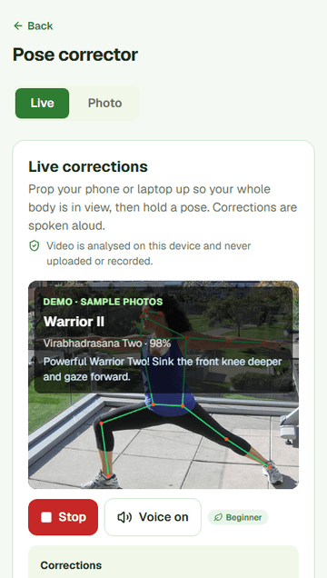
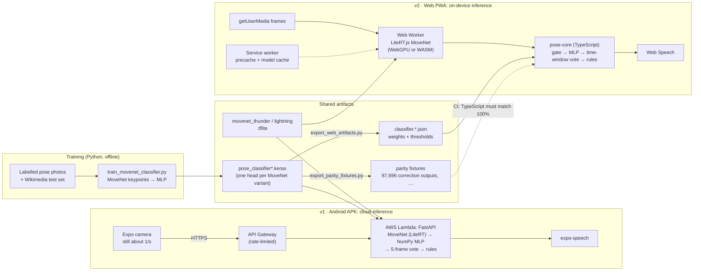

# Yoga Therapy

Yoga routines for 11 health conditions, with an AI pose corrector that watches
you through the camera and speaks corrections. It ships as an **installable web
app that runs the pose model on your device** and as an **Android app** backed
by a serverless API.

[](https://github.com/atharvaawate22/yoga-therapy-app/actions/workflows/web-ci.yml)
[](https://github.com/atharvaawate22/yoga-therapy-app/actions/workflows/backend-tests.yml)
[](https://github.com/atharvaawate22/yoga-therapy-app/actions/workflows/app-tests.yml)

<p>
  <a href="https://yoga.atharvaawate.me">
    
  </a>
  <a href="https://github.com/atharvaawate22/yoga-therapy-app/releases/latest/download/yoga-therapy.apk">
    
  </a>
</p>

<p>
  
</p>

<sub>Recorded from the real app (`web/scripts/record-demo.mjs`). Every label,
confidence and cue is the model's output in the browser. The sample photos come
from Wikimedia Commons, credited in
[ATTRIBUTION.md](web/public/lab/fixtures/ATTRIBUTION.md).</sub>

## Try it in 30 seconds

- **No webcam needed:** [yoga.atharvaawate.me/corrector?demo=1](https://yoga.atharvaawate.me/corrector?demo=1) runs the live corrector on sample photos.
- **With your camera:** open [/corrector](https://yoga.atharvaawate.me/corrector), tap *Start camera* and hold a pose. Frames are analysed on the device and never uploaded. Open the network tab to check.
- **On your phone:** open the site and use *Settings → Install the app*. After that it works offline, corrector included.
- **Android:** download the [APK](https://github.com/atharvaawate22/yoga-therapy-app/releases/latest/download/yoga-therapy.apk), or scan the code below from a laptop. It isn't on the Play Store; see the [user guide](USER_GUIDE.md) for install steps. It is rebuilt on every push to `main`, and all versions are on the [Releases page](https://github.com/atharvaawate22/yoga-therapy-app/releases).

<p></p>

## Two versions, one model

| | v1 · Android app | v2 · Web app (PWA) |
|---|---|---|
| UI | React Native (Expo) | Next.js 16 + TypeScript, static export |
| Pose model runs | On AWS Lambda (FastAPI, MoveNet on LiteRT, NumPy MLP) | In the browser (LiteRT.js on WebGPU or WASM, in a Web Worker) |
| Analysis rate | about 1 frame/s, over the network | 10–20 frames/s on a desktop (phone numbers pending) |
| Offline | Everything except the corrector | Everything, after the first visit |
| Pose logic | Python (`backend/yoga_pose_engine.py`) | TypeScript (`packages/pose-core`), held to the Python by golden parity tests |

Both versions run the same `.tflite` files and the same classifier weights,
exported from one training pipeline.

## Architecture



## Measured results

Every number here was measured; where a measurement is still missing, the table
says so.

**Classifier** (24 poses; details and per-class numbers in
[backend/README.md](backend/README.md#results)):

| Model | CV macro F1 | Leak-free test macro F1 | Independent Wikimedia photos (238): accuracy / macro F1 |
|---|---|---|---|
| MoveNet Thunder + MLP (desktop web, Android) | 0.782 | 0.828 | 0.800 / 0.652 |
| MoveNet Lightning + its own MLP head (phones on web) | — | — | 0.765 / 0.605 |

**Browser vs server parity:**

| Check | Result |
|---|---|
| Pose logic in TypeScript vs Python (CI, every PR) | 100% of 87,696 correction outputs, 1,000 full-pipeline frames and 300 vote sequences |
| MoveNet in the browser vs on the server (32 Wikimedia photos, `/lab`) | Thunder: mean keypoint error 0.00095, same result shown to the user on 32/32. Lightning: 31/32 |
| TF.js MoveNet v4 (rejected) | Mean keypoint error 0.0109, same result on 26/32 |

**Web performance:**

| Measure | Result | Where |
|---|---|---|
| Thunder inference | 39–43 ms on WebGPU; 74 ms on CPU (p50) | Desktop Chrome (GPU); headless Chromium (CPU) |
| Lightning inference | 13 ms on CPU (p50) | Headless Chromium, desktop |
| Main-thread long tasks during a live session | 64–67 per ~6 s on the main thread → 0 in a Web Worker | Thunder on CPU, fake camera, 3 runs |
| Phones (mid-range Android, iPhone) | Pending: run `/lab` → *Benchmark this device* | [device-testing.md](docs/device-testing.md) |
| Lighthouse, 6 pages (mobile) | Performance 93–98, accessibility 100, best practices 96, SEO 100 | Local run; CI fails a page below 90 / 95 / 95 / 90 |
| First-load JavaScript | about 200 KB gzipped per page | Static export |
| Offline precache | 302 files, 5.7 MB (pose photos: 7.9 MB of PNG → 0.23 MB of WebP) | Service worker |
| One-time model download | Lightning 9.4 MB or Thunder 25 MB, plus LiteRT WASM (8.9 MB) | Cached on first use |

## Design decisions

Each has a short record in [docs/adr](docs/adr/README.md):

- **The pipeline runs in the browser** ([0001](docs/adr/0001-in-browser-inference.md)). The result is privacy, offline use, and 10–20 frames/s on a desktop instead of about 1. A public demo also can't eat the API rate limit that APK users share.
- **A separate Next.js app, not Expo web** ([0002](docs/adr/0002-nextjs-not-expo-web.md)). The corrector needed a rewrite anyway, and the APK had to stay untouched. Content and storage code are still shared: the web app imports the RN app's `src/data` directly.
- **LiteRT.js runs the server's exact `.tflite`** ([0003](docs/adr/0003-litert-same-tflite.md)). It won a measured spike against TF.js and ONNX conversion. The faster TF.js failed parity because of different weights.
- **Pad, never crop** ([0004](docs/adr/0004-pad-never-crop.md)). This matches the server's pre-processing, after a crop/pad train/serve mismatch was found and fixed in the backend.
- **The MLP and the rules are plain TypeScript, held to Python by golden fixtures** ([0005](docs/adr/0005-pose-core-golden-parity.md)). The fixtures carry source hashes, so retraining or editing a rule without regenerating them fails CI.
- **A time-window vote on the web** ([0006](docs/adr/0006-time-window-vote.md)). It uses the server's majority rule over 1.2 s instead of 5 frames, so labels don't flicker at 15 frames/s.
- **Calendar reminders, not push** ([0007](docs/adr/0007-calendar-reminders.md)). Web Push would need a server and only works for installed apps on iOS.
- **A hand-written service worker** ([0008](docs/adr/0008-hand-written-service-worker.md)), **inference in a Web Worker** ([0009](docs/adr/0009-inference-in-a-worker.md)), and **the model chosen per device** ([0010](docs/adr/0010-model-per-device.md)).

## Web vs Android

| Feature | Android | Web | Why |
|---|---|---|---|
| Conditions, poses, guided practice, Surya Namaskar | ✅ | ✅ | Same content, imported from `src/data` |
| Voice cues | ✅ | ✅ | Web Speech API; voice quality depends on the OS |
| Screen stays on during practice | ✅ | ✅ on Chrome/Android | Screen Wake Lock API |
| History, streaks, custom sets, favorites | ✅ | ✅ per browser | Browser storage can be cleared, so Settings has JSON export and import |
| Daily reminder | ✅ notification | ⚠️ calendar (`.ics`) | Browsers can't schedule a notification while the page is closed |
| Live pose corrector | ✅ needs internet | ✅ on-device, works offline | The model runs in the browser |
| Photo check | ✅ | ✅ | Runs on the device |
| Without a server | All but the corrector | Everything | Static site, no backend |

## Features

- 🩺 11 health conditions with recommended poses, filtered by experience level
- 🧘 Timed guided practice with voice cues, prep countdowns and pause/skip
- ☀️ Surya Namaskar: 12-step guided rounds with breathing cues
- 📷 Live pose corrector: recognises 24 poses, draws the skeleton and speaks corrections; target-pose matching; photo check
- 📊 Practice history: day streaks, weekly minutes and a 7-day chart
- 📋 Custom routines you can build, reorder and play; favorite poses
- 📲 The web app installs to the home screen and works offline. The Android APK rebuilds on every push

## Engineering highlights

**Data quality work on the classifier** ([details](backend/README.md#data-cleaning)):
- Found a *train/serve mismatch*: the model was trained on centre-cropped images while the server padded them. Training also skipped the server's EXIF rotation. Both now go through one shared preprocessing function.
- Found 200 training images labelled **both** cobra and upward dog (the same file in two folders). Also found that **35% of the test set** (1,143 of 3,425 images) duplicated training images. Extraction now drops label conflicts and duplicates, and evaluation excludes the copies.
- Added grouped k-fold cross-validation, chose training options by multi-seed ablation, and merged or dropped classes the data couldn't support.
- Built an **independent test set** of 238 freely licensed Wikimedia Commons photos, hand-reviewed and checked against training data with a perceptual hash. The hash caught 12 resized copies that an exact match would miss.
- Result: macro F1 **0.746 → 0.828** on the leak-free test set and **80% accuracy** on the independent photos.

**Serverless serving (v1).**
- The API runs as a container on AWS Lambda behind a rate-limited API Gateway, with no TensorFlow at runtime: MoveNet runs on LiteRT, and the classifier runs in NumPy straight from the Keras file (equal to Keras within 3×10⁻⁷).
- Models load in under a second, down from timing out the 30 s gateway.

**On-device inference (v2).**
- The same model runs in the browser through LiteRT.js, in a Web Worker, with automatic fallbacks: WebGPU → CPU, and worker → main thread.
- If Thunder runs slower than 150 ms per frame on a device, the live session switches to Lightning by itself.
- The pose logic is a framework-free TypeScript package checked against Python output on every PR.

## Testing and CI

| Suite | Tests | Runs |
|---|---|---|
| Backend (pytest, no TensorFlow needed) | 243 | `backend-tests.yml` on backend changes |
| App (Jest, including an app↔model contract test) | 33 | `app-tests.yml` |
| `pose-core` (Vitest, including the parity suites) | 107 | `web-ci.yml` |
| Web unit (Vitest + Testing Library) | 121 | `web-ci.yml` |
| Web end-to-end (Playwright, Chromium) | 5 | `web-ci.yml`: offline app, offline corrector, and the live camera path through Chromium's fake camera playing a Warrior II clip |
| Lighthouse budgets | 6 pages | `web-ci.yml` |

**Deployments:**
- Each backend deploy builds the image and smoke-tests the real models in it before it goes live.
- Pushes to `main` that touch the app build an APK with EAS and publish it to the download link.
- The web app is a static export hosted on Vercel.
- Web-only changes don't spend EAS build quota.

## Tech stack

**Web app (`web/`, `packages/pose-core`):**
- Next.js 16 (App Router, static export, Turbopack), TypeScript, Tailwind CSS 4
- LiteRT.js (WebGPU/WASM), Web Workers, a service worker, Web Speech, Screen Wake Lock
- Vitest, Testing Library, Playwright, Lighthouse

**Android app:**
- React Native with Expo SDK 54, React Navigation
- Expo Camera, Image Picker, Speech, Notifications

**Pose-analysis backend (`backend/`):**
- FastAPI on AWS Lambda (container image) behind API Gateway
- MoveNet SinglePose Thunder (Lightning optional), run on LiteRT
- A small MLP classifier, trained with TensorFlow/Keras and served with plain NumPy
- OpenCV, Pillow, NumPy, pytest

## Project structure

```
├── App.js, src/                 # React Native app (Expo)
│   └── data/                    # Poses, conditions, tips, storage (also used by web/)
├── web/                         # Next.js PWA (see web/README.md)
│   ├── src/app/                 # Pages: conditions, practice, corrector, lab, …
│   ├── src/inference/           # LiteRT.js MoveNet, Web Worker, skeleton drawing
│   ├── sw/, scripts/            # Service worker, build and measurement scripts
│   └── e2e/                     # Playwright tests
├── packages/pose-core/          # Pure TypeScript pose logic + golden parity fixtures
├── backend/                     # FastAPI service, training, evaluation, web exports
│   └── models/                  # MoveNet .tflite files, classifier heads, labels
└── docs/                        # Web plan and audit, ADRs, device testing, recording guide
```

The training datasets aren't in the repo because of their size. The trained
models in `backend/models/` are, so the app, the backend and the web app all
work without them. Retraining is described in
[backend/README.md](backend/README.md).

## Getting started

**Web app** (Node 22):

```bash
cd web
npm install
npm run dev
```

Then open http://localhost:3000. Scripts, structure and deployment are in
[web/README.md](web/README.md).

**Android app** (Node 20+):

```bash
npm install
npx expo start
```

Scan the QR code with Expo Go, or press `a` for an emulator. For a standalone APK:

```bash
eas build --platform android --profile preview
```

`.github/workflows/eas-build.yml` does this on every push to `main` that can
change the app. It needs an `EXPO_TOKEN` repository secret. The build is
published to the rolling `latest-preview` release that the download button
points to. If the corrector can't reach the backend, the APK falls back to a
result clearly labelled **DEMO**, which is never saved. The web app has no such
fallback: every result it shows is real.

**Backend** (only for backend development; the APK uses the hosted API). From
`backend/`:

```bash
pip install -r requirements.txt
uvicorn yoga_pose_engine:app --host 0.0.0.0 --port 8000
```

Tests need no TensorFlow:

```bash
pip install -r requirements-dev.txt && pytest
```

In an Expo dev build, the app uses your machine's LAN IP on port 8000, so the
phone and the computer must be on the same Wi-Fi. See
[backend/README.md](backend/README.md) for training, evaluation and the web
exports.

### Pose API

`POST /analyze-pose`:

```json
{
  "image_base64": "<JPEG/PNG, optionally a data URL; max ~3 MB>",
  "session_id": "<stable per live session; enables the stability filter>",
  "source": "live | image",
  "experience_level": "beginner | intermediate | expert",
  "include_debug_image": false
}
```

Response:

```json
{
  "pose": "warrior_pose",
  "confidence": 0.92,
  "corrections": ["Keep both arms level — extend equally left and right"],
  "distances": { "warrior_arm_span": 210.5, "warrior_arm_height_offset": 12.3, "warrior_wrist_height_diff": 8.1 },
  "debug_image_base64": null,
  "probabilities": { "warrior_pose": 0.92, "...": 0.01 }
}
```

- `pose` is `"nopose"` when no full body is visible or the classifier isn't confident.
- `distances` are in percent of the person's torso length.
- `GET /health` is a cheap liveness probe. `GET /warmup` loads the models ahead of the first request.

## Health conditions covered

Back pain, hip alignment, scapula winging, knee pain, poor posture, headache,
stress, anxiety, insomnia, digestion issues and weight loss. To add one, add an
entry to `src/data/yogaData.js` with the `p(...)` helper. The pose id must be in
`ALLOWED_POSE_IDS`. The web app picks it up at the next build.

## Disclaimer

This app gives general yoga recommendations for educational purposes only.
Consult a healthcare professional before starting any new exercise programme,
especially if you have existing health conditions.

## License

MIT. See [LICENSE](LICENSE).
